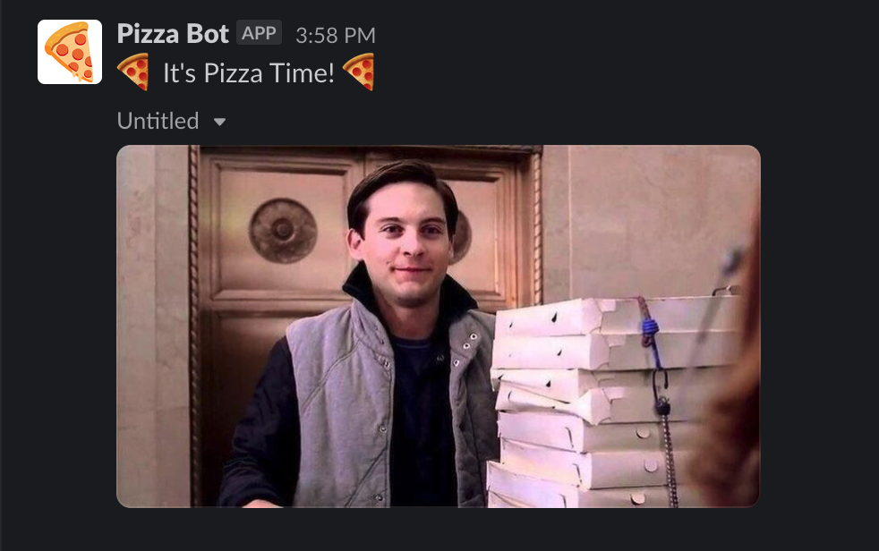
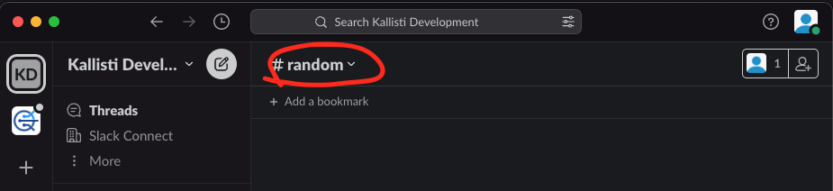
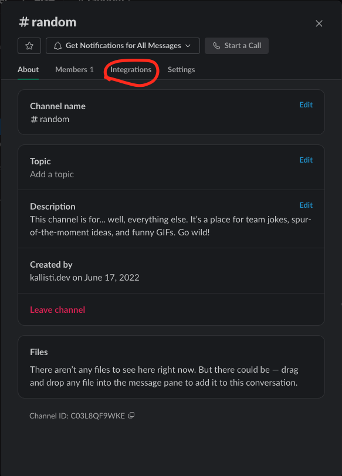
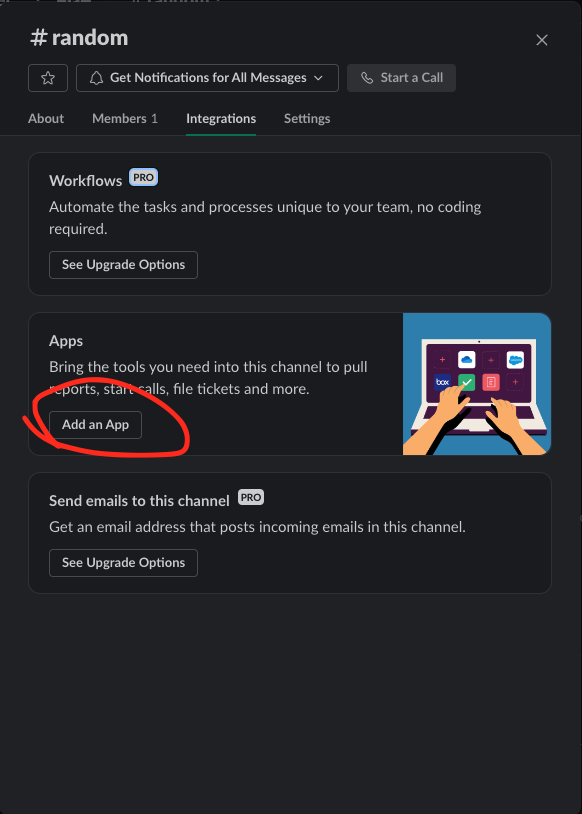
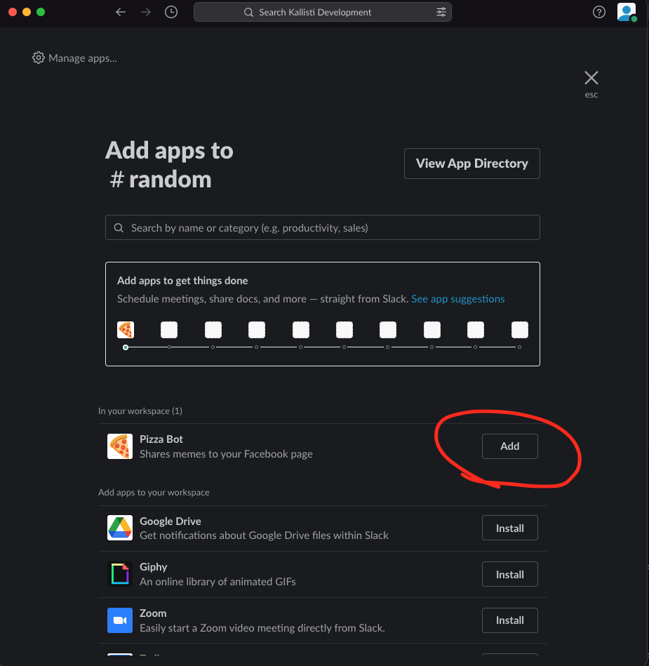
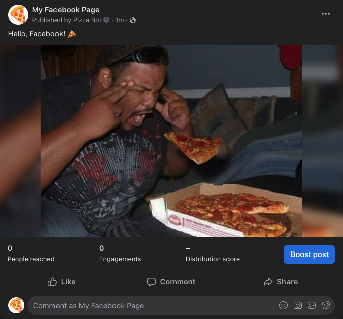

# Pizza Bot Guide

# What is Pizza Bot?

Pizza Bot is a simple Slack bot to integrate your Slack Workspace with a Facebook page. Any messages in Slack with the pizza emoji 🍕 will be automatically posted to the linked Facebook page.

# How to Install

1. Go to [https://pizza-bot-356516.wl.r.appspot.com/slack/install](https://pizza-bot-356516.wl.r.appspot.com/slack/install) 
2. Allow the app to be installed on your Slack workspace
3. You will be redirected to Facebook. Allow the app to access your Facebook page
    
    <aside>
    ⚠️ NOTE: The bot can only link to **ONE** Facebook page per Slack workspace. Allowing access to multiple pages will **NOT** work and only the first page will be linked.
    
    </aside>
    
4. You should now see Pizza Bot in your Slack workspace!
    
    
    

# Invite to your Channel

Now you’ll need to invite the bot to the channel(s) you want it to listen to.

1. Click on the name of the channel here
    
    
    
    
2. Go to the “Integrations” tab
    
    
    
    
3. Click on “Add an App”
    
    
    
    
4. Click “Add” next to Pizza Bot in the list of apps.
    
    
    
    

# How It Works

1. The bot will wait in the background and look for messages that contain a 🍕 pizza emoji 🍕
    
    
    
    
2. When the bot sees a message, it will automatically share it to your Facebook page as a post.
    
    
    
    
3. Any replies on the Slack thread will also be sent to the Facebook post as comments
4. The bot will also notify you when a Facebook user comments on the post, by replying to the original Slack thread.
